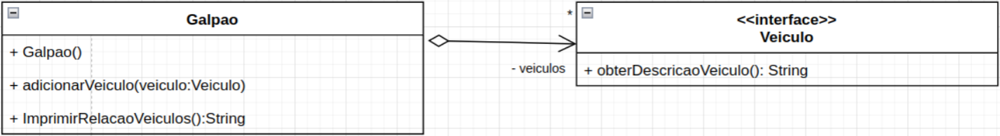

<h1 align="center" style="font-weight: bold;">Parte 2</h1>

Considerando o diagrama de classes abaixo, que complementa o diagrama anterior. Crie a classe
Galpão. A classe galpão possui uma agregação com muitos veículos, não importando se esses veículos são
terrestres, aéreos ou aquáticos. Perceba que Veiculo é uma interface que especifica um método abstrato que
retorna um TEXTO contendo todas as informações do veículo. Você deve fazer com que todos os veículos de
Steve possam ser inseridos no galpão, sem alterar o tipo do parâmetro do método adicionarVeiculo na classe
GalpÃOo. Você deverá decidir que alterações precisarão ser realizadas nas classes do Exercício 1 para atender a
esse requisito. Atenção, para a solução dessa atividade NÃO é necessário utilizar o operador instanceof e nem
realizar testes condicionais para decidir o tipo de veículo.

O método “imprimirRelacaoVeiculos” da classe Galpão imprime o detalhamento de todos os veículos que estão
no galpão.

